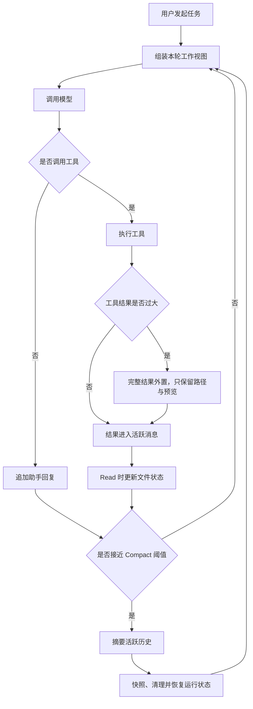

2026 年 3 月底，一份 Claude Code 源码曾意外暴露在 GitHub。我沿着上下文相关代码往下读，最想回答的是一个使用中很常见的问题。

让 Claude Code 连续读文件、跑命令、修改代码几十轮之后，最早的需求早就不可能原样装进上下文窗口了。它为什么还能接着工作？

答案不是模型拥有了长期记忆。每次调用，模型只看见 Claude Code 在这一轮重新组装的内容。Claude Code 真正维护的，是一份能让模型继续执行、能回查原始材料、也能在压缩后恢复的**任务状态**。

## 这篇文章会建立什么认知框架

上下文管理很容易被讲成一堆名词：窗口、工具结果、摘要、Compact、缓存、附件。本文不按代码目录逐个解释它们，而是先建立一条运行时链路，再把每个机制放回它在链路中的位置。

本文会沿着「一份工作视图如何在长任务中增长、压缩并重建」的顺序展开：

- 先界定一次 Claude Code 请求里模型真正看见什么，以及 Agent 的上下文压力为何分成「单条结果爆炸」与「多轮历史累积」两类。
- 然后解释第一道防线：超大工具结果为什么在产生时就被外置，模型窗口只保留预览和回查路径。
- 接着进入 Auto-Compact：Claude Code 在什么预算下触发压缩，结构化摘要保留什么，又为何不能把摘要当作完整状态。
- 再拆解 Compact 后的恢复过程：最近文件、项目规则、后台 Agent 和工作流状态如何重新回到下一轮工作视图。
- 最后回到这套设计仍未硬保护的部分：任务目标、约束与验收条件为何可能随摘要漂移，以及实验机制在尝试提前处理哪些压力。

这不是按源码目录罗列函数，而是按上下文压力逐步升级的顺序，解释 Claude Code 为什么需要一层接一层地处理它们。

本文希望能够回答这些问题：

- 一次 Claude Code 请求里，模型真正看见什么，哪些信息其实在窗口外。
- Agent 的上下文压力为什么分成「单条结果爆炸」与「多轮历史累积」两种不同问题。
- 大结果落盘、Auto-Compact、摘要、文件恢复和项目规则重注入，为什么必须连起来看。
- Compact 之后，Claude Code 靠什么让模型接上原来的工作，又有哪些事实仍可能在摘要中漂移。

先定义本文的核心概念。这里的「上下文生命周期」不是指信息本身何时产生和消失，而是指 Claude Code 在跨轮任务中，如何让某类信息进入模型窗口、何时将它移出、需要时又如何恢复。

Claude Code 每次调用模型前，都要组装一份可执行的工作视图。组成这份工作视图的信息大致可分为四类：

| 信息类别 | 在 Claude Code 中的例子 | 跨轮处理方式 |
|---|---|---|
| 长期规则 | system prompt、工具定义、`CLAUDE.md` | 下一轮请求时重新加载或重新注入，不依赖摘要保留 |
| 可回查的原始材料 | 超大命令输出、超大日志、超大文件读取结果 | 写入外部文件；模型窗口只保留路径和预览，需要时重新 Read |
| 对话中的任务语义 | 用户目标、错误教训、已完成工作、下一步 | 历史过长时压成结构化摘要 |
| 文件与执行状态 | 最近读取文件、后台 Agent、计划、已加载 Skill | Compact 后按当前状态重新读取或重新装配 |

后文会反复出现 Auto-Compact。先给出最小定义：当活跃上下文接近模型窗口上限时，Claude Code 会启动 Auto-Compact，用一份结构化摘要替换过长的活跃历史，并开始重建下一轮的工作视图。具体的触发公式、摘要格式和恢复步骤会在后文逐一展开。

从这个定义再回看上表，Auto-Compact 的职责跨越多类信息。Auto-Compact 是一次工作视图的换挡过程：Claude Code 用结构化摘要压缩活跃对话中的任务语义，同时清理已经不再被模型看见的旧状态，再重新注入最近文件、后台 Agent 等执行状态；长期规则则在下一轮照常重新加载。若把 Auto-Compact 只理解为「对话总结」，读者就会遗漏 Compact 后半段的状态恢复。

> **核心框架**：Claude Code 管理的不是一段会无限增长的聊天记录，而是一份由规则、原始材料、任务语义和执行状态共同组成的工作视图。

---

## 一次请求里，模型到底看见什么

模型没有自动记忆。每一轮请求中，Claude Code 发送的是当前可用的工作视图：

```text
System Prompt / 工具定义 / 运行环境
+ CLAUDE.md 等项目规则
+ 当前活跃消息
+ 本轮附件
```

活跃消息包括仍保留的用户消息、助手回复、工具调用和工具结果。附件则包括 Compact 后重新提供的最近文件、计划、Skill、异步 Agent 状态等。

与之相对，transcript、大工具输出全文、任务列表和后台 Agent 的完整结果通常处于外部状态。这些外部状态未必会自动进入模型窗口，需要 Claude Code 重新注入，或由模型通过工具主动回查。

从用户任务到下一轮请求，主干循环可以先看成这样：



后文依次解释这张流程图中的节点：每一章都会回答三个问题，Claude Code 在该节点处理什么压力、为什么选用这种动作、这个动作还留下什么问题。

## 为什么 Agent 的窗口会比聊天更快失控

普通聊天通常只增加一条用户消息和一条回答。Agent 的一次工具调用至少会留下工具请求和工具结果；真正占空间的是 `tool_result` 中的文件内容、日志和命令输出，它们可能在后续多轮请求中反复进入上下文。

因此，Agent 的上下文压力至少有两种形态：

```text
压力一：一条结果突然极大
        例如一条 Bash 日志或一次 Read 就有几十万字符

压力二：每条结果都不算极大，但持续累积
        例如多个文件、grep 输出、分析过程和修改记录逐轮叠加
```

这两类压力不能用同一个动作处理。前者应该在结果产生的瞬间拦住，后者则需要等到整个活跃工作视图接近窗口边界时再重建。

常见方案也各自解决不同问题。

| 方法 | 适用场景 | 局限 |
|---|---|---|
| 只保留最近消息 | 对话短、早期历史价值低 | 容易直接丢失目标、失败教训和设计决策 |
| 固定轮数摘要 | 历史增长相对稳定 | 轮数不等于 token 压力，压缩可能过早或过晚 |
| 向量召回 | 从海量资料找局部事实 | 不会天然恢复连续任务的执行状态 |
| 分层状态治理 | 编码 Agent 的长任务 | 需要区分不同信息的可恢复性与生命周期 |

> **问题分类决定处理方式**：Claude Code 先处理即时的大结果，再处理长期累积的活跃历史，最后把下一轮真正需要的状态重新建立出来。

## 第一层，单条大结果在产生时就外置

现在可以回到流程图中的第一个分支。一次 Bash 输出、日志检索或读取生成文件，可能带回几十万字符。Claude Code 不会等到 Compact 才处理它；结果超过有效阈值后，完整内容会写入 session 目录，进入 `tool_result` 的只剩保存路径、大小说明和开头预览。

> **源码事实**：当前研究样本中，默认单结果阈值为 **50,000 字符**，预览目标长度为 **2,000 字符**。相关常量可在 `src/constants/toolLimits.ts` 中核验。

```text
<persisted-output>
Output too large.
Full output saved to: <session 中的文件路径>

Preview (first 2 KB):
<输出前缀>
...
</persisted-output>
```

Claude Code 没有简单丢掉大工具结果。模型仍知道工具完成了、输出有多大、开头是什么，也知道需要细节时去哪里重新读取。大结果外置机制保存的是模型的行动能力，而不是把全文强行留在窗口里。

### 为什么 Claude Code 选择「外置加预览」而不是直接截断

不能把「外置全文加预览」写成业界唯一方案。上下文治理没有统一标准，不同 Agent 框架和平台会选择不同策略。比如 LangGraph 明确提供按 token 保留最近消息、删除消息、摘要消息和 checkpoint 回查等做法；OpenAI 的 Realtime API 也支持超过窗口后截去最早消息，并允许配置保留窗口的一部分。它们证明直接截断、保留最近消息和摘要都是现实中被采用的工程选择。[LangGraph 的短期记忆文档](https://langchain-ai.github.io/langgraph/how-tos/memory/manage-conversation-history/)、[OpenAI Realtime 截断策略](https://platform.openai.com/docs/api-reference/realtime-beta-client-events/conversation/item/truncate?api-mode=responses)

面对一条超大工具结果，常见处理方式可以这样比较：

| 处理方式 | 好处 | 代价 | 更适合的场景 |
|---|---|---|---|
| 完整保留在上下文 | 模型立刻拥有所有细节，不需要二次读取 | 一条异常结果就可能耗尽窗口，并在后续轮次持续占用输入 | 小结果或每个字符都必须立即参与推理的交互 |
| 直接截断 | 实现最简单，能硬性限制 token | 被截掉的部分没有回查路径，模型无法区分「不存在」和「我没看到」 | 日志尾部、进度输出等确认无价值的内容 |
| 只保留摘要 | 压缩率高，阅读负担低 | 摘要可能遗漏精确字段、错误栈或代码细节 | 结果本身只需要结论，不需要原始证据 |
| 外置全文并保留预览与路径 | 立即控制窗口，同时保留精确回查能力 | 模型需要主动发起一次读取，增加一次工具交互 | 编码 Agent 常见的大日志、大文件和命令输出 |

> **工程解读**：从「完整结果写入 session 文件、上下文保留预览和路径」这一结构可以推断，Claude Code 的优先级是：**大结果不必常驻模型窗口，但必须可被重新获得**。预览帮助模型判断是否值得回查，保存路径让模型在需要精确证据时恢复全文。这种设计的代价是多一次工具调用；对于会被后续多轮反复携带的超大结果，这个代价通常低于始终把全文留在上下文里。

「外置加预览」这套结构有个几十年前的老前辈。操作系统处理「内存装不下」的办法是虚拟内存：把页放到磁盘，页表里只留指针，真正访问时靠一次缺页中断把内容调回来。大结果外置是同一个思路，session 目录是磁盘，预览和路径是页表项，重新 Read 就是一次缺页调入。

大结果外置机制故意只解决压力一。十几条没有超过 50,000 字符的工具结果依然会进入活跃消息，随着对话持续累积。大结果落盘之后，窗口仍会慢慢变满；这就是 Claude Code 还需要 Compact 阈值的原因。

## 第二层，累计历史接近上限时才 Compact

Claude Code 的 Auto-Compact 专门处理压力二。Claude Code 不采用「用到八成就总结」的固定百分比规则，而是计算一笔为 Compact 调用本身预留空间的上下文预算。

设模型原始窗口为 `W`，当前主干逻辑可以概括为：

```text
有效上下文窗口
= W - min(模型允许的最大输出 token，20K)

Auto-Compact 触发线
= 有效上下文窗口 - 13K
```

以 `W = 200K` 为例：

```text
200K 原始窗口
- 20K 摘要输出预算
= 180K 有效窗口

180K
- 13K 提前触发缓冲
= 167K 触发线
```

> **源码事实**：**20K** 是摘要输出预算。源码注释提到，历史摘要长度的 p99.99 约为 **17,387 token**，因此向上取整。**13K** 不代表另一份摘要预算，而是给 Compact prompt、消息包装、计数误差和失败恢复留出的安全边际。触发逻辑位于 `src/services/compact/autoCompact.ts`。

### 为什么 Claude Code 不直接采用固定百分比

`167K` 是前述 200K 窗口示例的计算结果。Claude Code 根据当前模型窗口 `W`、本轮允许的最大输出和 Compact 的安全余量，推导本轮的绝对触发线；这与为所有模型写死同一个绝对阈值不同。Claude Code 没有采用「占用达到 80% 或 90% 就压缩」这类纯比例规则。

上下文治理中常见的触发方案可分为四种：

| 触发方案 | 公式或例子 | 优点 | 主要缺点 | 更适合的场景 |
|---|---|---|---|---|
| 固定轮数 | 每 20 轮压缩 | 最简单，行为容易预测 | 一轮工具结果可能只有几十 token，也可能是几万 token；轮数无法描述真实压力 | 消息大小高度稳定的简单对话 |
| 固定占用比例 | `当前输入 ≥ 0.9 × W` | 能随窗口大小自动缩放，配置成本低 | 把所需余量也按窗口同比放大，且看不见输出预算与压缩成本 | 只需粗粒度预警，输出预算变化很小的系统 |
| 写死绝对阈值 | `当前输入 ≥ 167K` | 运行行为稳定，容易观测和调试 | 从 256K 切到 1M 窗口时仍在 167K 压缩，完全没有利用新增窗口 | 单模型、固定窗口、固定请求结构的内部服务 |
| 可用窗口预算 | `当前输入 ≥ W - 输出预算 - 安全余量` | 余量按实际风险预留，窗口变化时触发线随之适配 | 需要掌握输出上限、压缩成本与可靠性余量，设计和观测更复杂 | 多模型或长任务 Agent，需要尽量避免临界失败 |

固定百分比的隐患，恰好会在模型窗口跃迁时放大。假设系统一直保留 10% 空间：256K 窗口留下约 25.6K，1M 窗口则留下约 100K。若 Compact 调用真正需要的空间仍约为 20K 到 30K，切到 1M 模型后多出来的七万多 token 并不是必要的风险余量，而是因为比例规则被动放大的闲置窗口。更晚触发也会让系统在更长的历史上持续支付输入成本，并增加无关历史干扰的机会。

纯百分比方案并非错误。若模型最大输出会随窗口同比增长，或者产品确实希望始终保留同等比例的回旋空间，比例规则有合理性。OpenAI 的 Realtime API 就允许客户端指定保留最大上下文的一部分，以减少后续截断和缓存失效。[OpenAI Realtime 截断策略](https://platform.openai.com/docs/api-reference/realtime-beta-client-events/conversation/item/truncate?api-mode=responses)

> **决策结论**：当前源码中的 Auto-Compact 属于第四种。Claude Code 先扣除摘要输出预算，再扣除安全缓冲，才决定何时压缩。这套计算首先保证 Compact 调用本身仍有足够空间完成。

这类预算方案确实需要更工程化的前提。即使一个简单 Agent 可以用保守的最大输出值手工设置余量，Claude Code 仍进一步把摘要预算建立在历史摘要输出 p99.99 约 17,387 token 的统计上，并向上取整为 20K。13K 则作为未被细分的工程安全边际。也就是说，Claude Code 不只写下一个公式，还通过历史样本为公式中的关键参数提供了依据。

这里同样不该照抄 167K。可迁移的经验是，阈值要同时为正常请求、压缩请求和失败恢复留空间；只按照上下文占比做判断，往往忽略了真正危险的最后一步。

Claude Code 还要避免 Auto-Compact 自我失控。Auto-Compact 过程中不会再次触发 Auto-Compact，连续失败三次会熔断，防止窗口临界时陷入无限重试。

用户还可以通过 `/compact` 手动触发同类能力，并附加「重点保留数据库迁移决策」之类的要求。自动 Compact 的目标是不中断任务地续航，手动 Compact 的目标是带着用户指定的重点换挡。

## 第三层，Compact 压缩的是任务语义，不是最后几轮对话

达到阈值后，Claude Code 不只是删掉最早消息或保留最后 N 轮。Claude Code 会将当前活跃对话交给专用摘要调用，要求摘要覆盖任务连续性所需的结构化状态。

下面是按源码要求整理的骨架，不是原始 prompt 的逐字转录：

```text
<summary>
用户主要目标与意图
关键技术概念
相关文件和代码
错误与修复
已解决与仍在处理的问题
所有用户消息
待办任务
当前工作
下一步
</summary>
```

摘要器被禁止调用工具，输出里的 `<analysis>` 草稿会被剥离，最终只有 `<summary>` 进入后续上下文。

Auto-Compact 不是免费操作。Claude Code 仍需调用模型生成摘要，但会优先尝试与主会话共享 Prompt Cache：沿用相同模型，并尽量保持 system prompt、工具定义、`CLAUDE.md`、推理配置和历史消息前缀一致，只在末尾追加 Compact 专用指令。缓存无法共享时，Claude Code 才回退为普通流式摘要调用。

> **能力边界**：结构化摘要将活跃历史从大量原始消息转换为较短的语义状态。结构化摘要能让任务续航，却不是可靠的状态序列化。源码要求枚举所有用户消息，是为了降低遗漏风险；Claude Code 的摘要机制不能形式化保证每条约束、每次需求变化和每个技术决策都必然无损。

结构化摘要负责保留任务语义。运行状态由接下来的恢复步骤重新建立。

## 第四层，恢复的关键是不让系统误判模型知道什么

在 Claude Code 的流程图中，摘要之后不是直接开始下一轮，而是先快照、清理和恢复状态。状态恢复环节遵循的核心不变量是：

> **核心不变量**：Claude Code 对「模型已经知道什么」的判断，必须与模型当前真正看得到的内容一致。

`readFileState` 是该不变量最直观的例子。`readFileState` 是进程内的文件上下文状态表，记录模型看过哪些文件、当时的内容或版本、最近访问时间。Compact 后，旧 Read 工具结果不再发送给模型。如果 Claude Code 不清空 `readFileState`，系统仍会错误地以为模型已经知道文件内容，后续可能不再注入相关文件。

因此 Compact 成功后的顺序是：

```text
1. 快照 readFileState
2. 清空 readFileState 与已注入嵌套记忆路径
3. 并发生成恢复附件
4. 重建活跃消息
5. 下一轮重新加载 CLAUDE.md 等 userContext
```

恢复的不是同一种东西，而是四类不同状态。


*图：Compact 后，摘要只携带任务语义（虚线，压缩后的信息流）；最近文件、项目规则、后台任务和计划与工具状态均从原始来源沿各自路径重建，汇入下一轮工作视图（示意图，基于源码研究样本）。*

| 状态 | 如何恢复 | 为什么不靠摘要 |
|---|---|---|
| 最近文件 | 从快照按最后访问时间选择最多 5 个，从当前磁盘重新读取，每个最多 5K token | 文件可能已变，模型需要可直接使用的当前内容 |
| 项目规则 | 清理 `getUserContext` 等缓存后，下轮重新加载 | 规则必须稳定注入，不能赌摘要刚好记住 |
| 异步 Local Agent | 以 `task_status` 附件提供任务描述、状态、进度或错误、输出路径 | 主 Agent 需要避免重复创建，并知道结果去哪取 |
| 工作流与工具状态 | 当前计划、Plan Mode、已加载 Skill、延迟加载工具、MCP 指令等按类型装配 | 这些状态决定下一轮能做什么，而不只是过去发生了什么 |

最近文件恢复位于 `src/services/compact/compact.ts`。源码会重新从磁盘读取，而不是复用旧 Read 结果。这里的选择很明确：宁可少带一点历史，也要让模型看见当前可用的文件版本。

## 压缩后，模型接收到的是一份新的工作视图

现在再回看开头的「模型真正看见什么」，Compact 前后的变化就清楚了。

```text
压缩前
用户目标
→ Read(a.ts) 的完整结果
→ 多轮分析、修改、测试
→ 更多工具结果

压缩后
Compact Boundary
+ 结构化摘要
+ 最近恢复的文件附件
+ 当前计划 / Skill / 异步 Agent 状态等附件
+ 下一条用户消息或新的工具结果
```

原始消息不再逐条进入模型窗口，但不等于所有细节都消失。不同信息有不同的外部回查路径：

| 需要回查什么 | 去哪里找 |
|---|---|
| 精确旧对话细节 | transcript |
| 大工具输出全文 | 持久化输出文件 |
| 最新文件内容 | 重新 Read |
| 后台 Agent 结果 | 输出文件路径 |
| 通用任务清单 | `TaskList` / `TaskGet` |

Claude Code 的上下文治理链路可以压缩成一句话：大结果外置，累计历史摘要，规则与状态重建，原始细节按需回查。

## 仍未被硬保护的，是任务契约

理解了状态恢复链路之后，读者才能看清 Claude Code 上下文管理机制的能力边界。

> **任务契约：仍未被硬保护的缺口**：Claude Code 很擅长在 Compact 后让模型重新获得项目规则、当前大致目标、最近关键文件、后台 Agent 状态和外部回查路径；但第一轮任务目标、不可违反的约束和验收标准，主要仍依赖 LLM 生成的摘要持续传递，并没有成为不可压缩、每轮必注入的 Task Contract。

简单任务中这通常足够。长达数小时、经历多次 Compact、包含多项硬约束与架构决策的任务，则可能出现摘要漂移：系统从「继续执行原始目标」逐渐变成「继续执行摘要转述后的目标」。例如「兼容旧数据，且不得修改某公共接口」在摘要中被模糊为「保持兼容性」，后续工作仍可能自认为没有偏离任务。

任务契约不应变成永久携带的全部历史，那样只会重新制造窗口问题。我认为更合理的补强是维护一份小型任务契约，只保存用户确认过的目标、硬约束、验收条件和关键决策，并在每次 Compact 后重新注入。小型任务契约不替代摘要，而是保护最不允许被摘要改写的事实。

## 实验机制说明了什么

Auto-Compact 主干之外，源码中还有几种试图更早、更轻量治理历史的方向。这些实验机制不需要被当成既有产品能力记住，但能帮助理解 Claude Code 的设计演进。

| 名称 | 试图处理的压力 | 基本思路 |
|---|---|---|
| Snip | 早期历史已经失去价值 | 让模型在正常回合标记局部消息，再删除对应内容，而不额外做整段摘要 |
| 时间型 Micro-Compact | Prompt Cache 大概率过期后，旧工具结果又要被整体重发 | 清除较早、可重新获得的 `tool_result.content`，保留最近结果 |
| Context Collapse | 希望保留本地完整历史，同时减少模型可见内容 | 本地 REPL 留原历史，调用模型时动态生成压缩投影视图 |
| Cached Micro-Compact | 直接改本地消息会破坏缓存前缀 | 通过缓存 API 删除旧结果，尽量同时降低上下文与缓存损失 |

Snip、Micro-Compact、Context Collapse 和 Cached Micro-Compact 的共同原则是：优先清理或外置可恢复的信息，最后才用概率性的语义摘要处理长历史。

但这些实验机制在研究样本中的完整度与启用状态不同。部分机制默认关闭，部分机制缺少核心实现或调用侧；因此可以学习设计意图，不能把相关阈值、行为和稳定性当作当前产品承诺。

## 结论：Claude Code 维护的是可恢复的工作视图

Claude Code 看起来像是记住了很久以前的一句话，背后不是模型突然拥有无限记忆。

Claude Code 维护的是一份工作视图：大结果先外置，活跃历史变长后压缩语义，再把规则、文件和运行状态按各自的生命周期重新建立。模型每次调用看到的不是完整过去，而是足够继续工作的当前状态。

这也划出了边界。只要关键事实仍要经由摘要转述，任务就有漂移风险。长时 Agent 的可靠性，不应只要求模型记住更多，还应让目标、约束和验收标准拥有一条不经过摘要的恢复路径。

给这条恢复路径找一个更老的参照物，是操作系统的虚拟内存。对「绝不允许被换出的内容」，它准备了钉住的页（pinned pages），数据库的缓冲池里也有同样的机制。类比在这里停住：操作系统的换页是无损的，页被换出时字节原样躺在磁盘上；Compact 换出的活跃历史，回来时变成了一份概率性的摘要。小型任务契约申请的，就是一个钉住的位置。

> 模型的记忆只持续一次调用，工程能维护的是一份可恢复、也应当可校验的任务状态。

---

研究说明

本文基于 2026 年 3 月底意外暴露在 GitHub 的 Claude Code 源码研究样本撰写。实现、阈值和 feature flag 会随版本变化。公开发布前，应补充研究快照的 commit hash、源码链接和访问日期；文中未确认完整调用链的实验机制不应作为产品行为引用。
