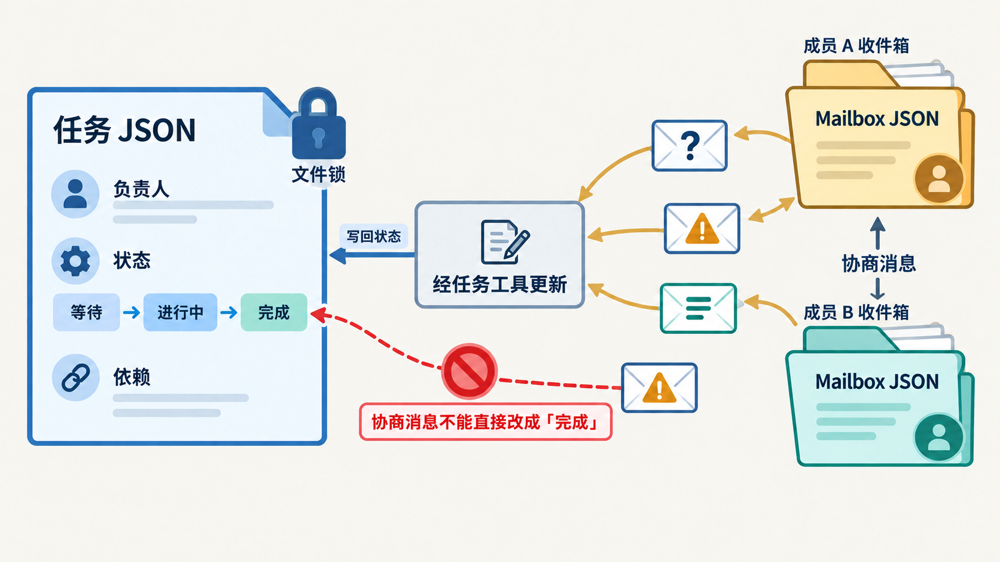
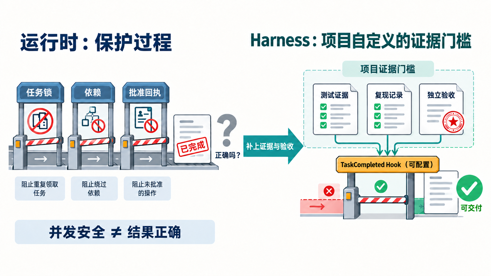

把一个任务交给多个 Agent，直觉上像是把工作拆开、同时开跑：几个人平级分工，最后把结果拼起来。

我最初也是这样理解 Claude Code 的 Agent Team。可沿着一项任务在源码里的路径往下看，原来的直觉连续被修正了四次。

| 读源码前的直觉 | 源码中的实现 | 修正后的判断 |
| --- | --- | --- |
| Team 是平级多 Agent 架构 | 团队配置显式保存 leadAgentId；teammate 空闲时会通知 Lead | 控制面以 Lead 为中心，工作面允许成员横向协作 |
| 成员在建队时就固定 | 每次 spawn 都向 members 追加成员，再通过 Mailbox 投递首次指令 | Team 是运行中会扩缩的工作集 |
| 协作靠一块共享白板 | 任务与消息分别写入 task JSON 和成员 inbox JSON | Task 保存事实，Mailbox 保存协商 |
| 有状态、锁和审批就会自动收敛 | 它们保护并发和授权；完成质量主要仍依赖 Lead、提示词与可选 Hook | 运行时硬化过程正确性，没有默认硬化语义验收 |

这四件事指向同一个判断：**Claude Code 的 Agent Team 不是“多开几个 Agent”的并行功能，而是一套把协作过程外置、把低层冲突和权限边界写进运行时、却把最终收敛留给 Harness 的协作运行时。**

本文研究的是 2026 年 3 月曾公开暴露的 Claude Code TypeScript 源码快照中的 swarm、task、mailbox、权限和 Hook 实现。它是特定时点的研究样本，不等同于官方仓库或当前发行版；下文的“源码事实”只适用于这份快照。

## 这篇文章会建立什么认知框架

先给 Agent Team 一个最小定义：它是一组各自拥有独立会话的 Worker，围绕团队配置、任务文件和成员收件箱协作；Lead 保留团队边界、用户授权和最终交付的责任。

这篇文章不按 Team、Task、Mailbox、Hook 的代码目录逐个介绍名词，而是只追踪一项任务。这里的“任务旅程”不是业务需求自然的生命周期，而是这项任务在协作运行时中经历的状态变化：它怎样有了责任中心，怎样成为可领取的共享事实，怎样在执行中协商和请求权限，最后又怎样从“完成”走到“可交付”。

| 这项任务的状态变化 | 机制与外置对象 | 本阶段解决的失败模式 | 留给下一阶段的缺口 |
| --- | --- | --- | --- |
| 被组织起来 | TeamFile、leadAgentId、动态 members | 没有责任中心，或成员能力在开始前就被固定 | 谁正在做什么，不能继续依赖 Lead 的对话记忆 |
| 可被安全认领 | 单任务 JSON、owner、依赖、文件锁 | 重复领取、越过依赖、并发检查与写入之间的竞态 | 任务状态不能承载所有讨论和临时发现 |
| 被协商并执行 | 成员 Mailbox | 讨论依赖私有上下文，消息彼此覆盖 | 一条协商消息不能变成用户授权 |
| 受限操作被批准或拒绝 | requestId 关联的权限请求与回执 | “有人说同意了”绕过真实授权 | 执行过程安全，不等于产物正确 |
| 从完成走向验收 | completed、TaskCompleted Hook、Lead、Harness | Worker 仅凭一句“做完了”结束任务 | 项目自己的证据标准必须被补进来 |

Lead 横跨表中的所有阶段，但它不是所有工作的转发器。它给协作一个可追责的入口，让 Worker 能横向执行和协商，同时不把团队边界、权限和对外交付放任为无主的公共状态。

本文沿“组织任务 → 认领任务 → 执行任务 → 验收任务”的顺序推进。每一章都回答同一个问题：这一阶段系统强制了什么，它仍然没有替团队决定什么，因此下一阶段为什么必然出现。

下面这张图是全文的路线图。先记住两条线：Task JSON 是可推进的事实线，Mailbox 是会改变决策、却不能自动改变事实的协商线；Lead 和 Harness 分别守在运行时的责任入口与交付出口。

~~~mermaid
flowchart TB
    U[用户目标] --> L[Lead：拆解任务、最终综合]
    L --> TF[TeamFile：leadAgentId + members]
    L --> SP[运行中 spawn Worker]
    SP --> TF
    SP --> IN[Worker inbox：首次指令]

    L --> TaskFile[任务 JSON：owner、status、blocks、blockedBy]
    W[Worker 独立会话] -->|锁内认领与更新| TaskFile
    TaskFile -->|状态与依赖| W

    W <-->|发现、提问、分派| MB[各成员 Mailbox]
    W -->|受限工具请求| PR[permission_request]
    PR --> L
    L --> UI[Lead 侧审批]
    UI -->|permission_response| W

    W -->|尝试 completed| H{TaskCompleted Hook}
    H -->|阻断或放行| TaskFile
    TaskFile --> V[Lead + Harness：核验证据、收敛、交付]
~~~

---

## 任务还不能开始，先要确定谁对协作负责

用户给出目标后，这项任务还不能立刻并行执行。首先要解决的是责任边界：谁能决定团队成员，谁处理例外，谁向用户解释最终结果。

创建团队时，TeamCreateTool 会构造 TeamFile。最醒目的字段不是成员数组，而是 leadAgentId：

~~~ts
type TeamFile = {
  name: string
  createdAt: number
  leadAgentId: string
  members: Array<{
    agentId: string
    name: string
    prompt?: string
    joinedAt: number
    isActive?: boolean
    mode?: PermissionMode
  }>
}
~~~

> **源码事实**：src/utils/swarm/teamHelpers.ts 中的 TeamFile 同时记录 leadAgentId 和成员的 joinedAt、isActive、mode 等状态；src/tools/TeamCreateTool/TeamCreateTool.ts 会创建首个 Lead 成员并写入团队配置。

teammate 初始化时读取 TeamFile 来定位 Lead。它结束当前回合时，会把自己更新为 idle，并向 Lead 的 Mailbox 写入空闲通知；这条逻辑由 src/utils/swarm/teammateInit.ts 注册为 Stop hook。

这不是传统的主从调度。Worker 可以直接给彼此发送消息，也可以自主认领可执行任务。更准确的分层是：

~~~text
控制面：Lead 建团队、拆任务、承接审批、处理例外、对外交付
工作面：Worker 独立执行、直接协商、自主领取可执行任务
~~~

如果每条消息和每次任务领取都必须经过 Lead，Lead 很快会成为吞吐瓶颈；反过来，若任一成员都能改变团队边界、批准权限或宣布最终交付，团队又没有责任中心。当前设计让执行在 Worker 之间横向流动，把治理集中到 Lead。

### 任务发现新缺口时，团队可以在运行中补人

有责任中心，不代表创建团队时已经知道这项任务需要哪些能力。也许 Worker 在实现时才发现需要安全审查、测试复核或另一条架构路径。源码显示，成员名单并不在创建时冻结。

src/tools/shared/spawnMultiAgent.ts 在启动 teammate 后，会读取 team file，把成员 push 到 members、写回文件，再把首次 prompt 投递到这个成员的 inbox：

~~~ts
teamFile.members.push({
  agentId: teammateId,
  name: sanitizedName,
  prompt,
  joinedAt: Date.now(),
  // model、backend、cwd 等运行信息
})
await writeTeamFileAsync(teamName, teamFile)

await writeToMailbox(sanitizedName, {
  from: TEAM_LEAD_NAME,
  text: prompt,
  timestamp: new Date().toISOString(),
}, teamName)
~~~

> **源码事实**：上述链路位于 src/tools/shared/spawnMultiAgent.ts 的成员注册与首次指令投递逻辑。teamHelpers.ts 还提供成员移除、模式更新和 active/idle 状态更新函数。

成员不是模型随意“冒出”更多角色。每一次加入都带有稳定 agentId、名字、模型、后端和加入时间，并落回 TeamFile；首次工作也通过 Mailbox 形成可见投递。这个机制更像一个动态工作池，而不是预先排班的会议室。

> **工程解读**：动态成员解决的是“何时补哪种能力”的弹性，代价是 Lead 必须自行判断是否值得扩容、谁适合接手。这些判断没有被 members 数组自动化。

到这里，这项任务已经有了责任中心和可变化的执行者，但“谁能参与”仍不等于“大家在做同一件事”。新加入的 Worker 不能只靠 Lead 某次对话中的描述理解任务；任务本身必须从口头指令变成全体成员都能重新读取的共享事实。

## 任务要能被安全认领，必须先变成外置的共享事实

团队边界确定后，任务才需要被拆成可执行的单元。这里不适合一块所有人都能随手修改的白板，而需要一项可以确定回答“谁拥有它、是否已完成、是否仍受依赖阻塞”的状态。

src/utils/tasks.ts 定义的任务对象包含：

~~~ts
type Task = {
  id: string
  subject: string
  description: string
  owner?: string
  status: 'pending' | 'in_progress' | 'completed'
  blocks: string[]
  blockedBy: string[]
  metadata?: Record<string, unknown>
}
~~~

getTaskPath() 会把每一项任务解析为单独的 JSON 文件。创建任务时，系统借助任务列表锁生成不重复 ID，再写入对应文件。因此，这项任务不再是 Lead 上下文中的一句安排；后续加入的 Worker 也能读取同一个外置对象。

真正决定能否认领的是 claimTask()。它锁住任务文件，重新读取最新状态，然后依次拒绝：任务已属于其他人、任务已经 completed、或 blockedBy 中还有未完成前置任务。若调用方要求检查 Worker 是否已经忙于另一项开放任务，代码还会用任务列表级锁把“查忙碌状态”和“认领”合进同一原子区间，避免 TOCTOU 竞态。

~~~text
锁住任务 JSON
→ 最新 owner 不是我：拒绝
→ status 已 completed：拒绝
→ blockedBy 中仍有未完成任务：拒绝
→ 否则写入 owner：认领成功
~~~

> **源码事实**：任务 schema 位于 src/utils/tasks.ts；claimTask() 会检查 owner、completed 与 blockedBy，并持有任务文件锁。checkAgentBusy 路径额外使用任务列表锁，使忙碌检查与认领原子化。

Task list 因而是一台小型共享状态机：它保证同一项任务不会被两个 Worker 同时成功认领，也不允许下游绕过尚未完成的依赖。它不判断任务拆分是否合理，更不判断验收条件是否充分。

这条边界正好逼出下一种机制。执行中的 Worker 会产生疑问、风险、建议和回报；这些内容会影响任务的后续决策，但一条“我做完了”的消息不能自动把 status 改成 completed。事实状态和协商记录必须分开存。

## 任务执行中，协商必须与任务事实分开

Task JSON 保存的是任务的事实状态，Mailbox 保存的是协商过程。src/utils/teammateMailbox.ts 将每个成员的收件箱放在：

~~~text
~/.claude/teams/{team_name}/inboxes/{agent_name}.json
~~~

一条消息保存 from、text、timestamp、read，以及可选的颜色和摘要。写入端先确保 inbox 存在，再锁住文件、重新读取最新消息、附加新消息后写回；读取端取 read 为 false 的项目，消费后标记已读。

~~~text
Task list：任务是否可领取、谁持有、是否完成
Mailbox：我发现了什么、要问谁、要把什么请求交给谁
~~~

> **源码事实**：路径和消息结构定义在 src/utils/teammateMailbox.ts；writeToMailbox() 使用 inbox 文件锁，并在锁内重新读取消息，避免多个发送者从旧数组写回时覆盖彼此。

这也是“Mailbox 加共享数据”比“共享白板”更克制的原因。若把讨论、风险发现、权限回执和任务状态塞进同一对象，协商消息会污染状态机，状态变化也会被误读成“有人只是说过”。当前设计允许消息影响 Lead 或 Worker 的判断，却不允许消息自动修改任务的完成事实。

> 图：任务 JSON 保存可推进的事实，成员 Mailbox 保存协商消息。消息可以触发后续判断，但只有经任务工具写回，状态才会改变。

这套分离还解释了动态成员为什么可行：新成员不必继承所有人的完整对话历史，只需从 task JSON 得到当前事实，从自己的 inbox 得到需要处理的协商。但相应地，Lead 必须把真正改变任务边界的发现写回任务图、验收条件或交付物；否则它仍会随着私有对话消失。

### 任务遇到受限操作时，Mailbox 必须升级为权限协议

普通协商到这里已经足够。但这项任务可能需要写文件、运行命令或访问受限资源；此时“另一个 Agent 在消息里说用户同意了”不能成为授权依据。Mailbox 可以运输请求，却不能自己制造用户授权。

Worker 发起受限操作时，权限轮询器会以 requestId 注册一个待处理 callback。收到 permission_response 后，processMailboxPermissionResponse() 按同一个 requestId 查找 callback、删除登记，再按 approved 或 rejected 恢复或拒绝调用。

~~~mermaid
sequenceDiagram
    participant W as Worker
    participant LM as Lead Mailbox
    participant L as Lead runtime
    participant U as 用户
    participant WM as Worker Mailbox

    W->>W: 注册 requestId callback
    W->>LM: permission_request(requestId, tool, input)
    LM->>L: inbox poller 解析请求
    L->>U: Lead 侧权限审批
    U-->>L: 批准或拒绝
    L->>WM: permission_response(requestId, decision)
    WM->>W: inbox poller 处理响应
    W->>W: requestId 匹配 callback，恢复或拒绝调用
~~~

> **源码事实**：src/hooks/useSwarmPermissionPoller.ts 维护 requestId 到 callback 的 pending registry，并只处理能匹配已登记 callback 的 mailbox response。src/utils/swarm/leaderPermissionBridge.ts 让 in-process teammate 复用 Lead 的权限确认队列。

权限边界的安全性不来自 Worker 相信 Lead 的一句话，而来自请求与回执的结构化关联、Lead 侧 UI 和用户决定。消息仍是载体，却不能冒充用户输入。

到这里，任务执行过程至少被两类机制保护：任务状态机阻止错误并发推进，权限协议阻止聊天绕过授权。但过程正确不等于结果正确。Worker 接下来可以尝试把任务标为 completed，而运行时的保证将在这里露出最后一条边界。

## 任务被标记完成，并不等于已经可以交付

我原本以为，既然任务有 owner、依赖、锁和权限协议，源码应该还会存在一个强制收敛器：没有测试证据就不能完成，Lead 未验收就不能交付。

源码没有给出这种默认硬约束。

TaskUpdateTool 的提示词要求 Agent：测试失败、实现不完整或错误未解决时，不要把任务更新为 completed；若遇到 blocker，保持 in_progress 并创建新任务。但这首先是给模型的操作指令。任务 schema 只有 pending、in_progress、completed 三个主状态，没有把“测试命令、测试输出、验收 verdict”设为必填字段。

完成前确实有一道可插拔关口：TaskUpdateTool.ts 在写入 completed 前执行 TaskCompleted hooks；任一 Hook 返回 blocking error，状态更新就会被拒绝。

~~~text
任务锁、owner、依赖、权限关联
→ 运行时硬约束

“测试是否充分”“结论是否正确”“是否可对外交付”
→ Lead 判断、可选 Hook、独立 verifier 或项目自己的验收流程
~~~

> **能力边界**：这份快照能证明 TaskCompleted hook 可以阻断状态更新，不能证明默认已安装某种测试或证据检查。源码也没有内置“完成证明”的 schema。因此，“语义收敛默认未被硬化”是对代码边界的判断；至于设计者是否相信模型能力、功能是否仍在实验，现有代码不足以断言动机。

> 图：Claude Code 运行时能阻止并发与授权错误，却不能默认证明结果正确。Harness 由项目自行定义证据门槛，并可通过 TaskCompleted Hook 接入完成状态的放行或阻断。

这不是遗漏一个字段的小问题，而是运行时与工程交付的分界。文件锁、依赖、所有权和请求关联可以抽象成相对通用的确定性规则；“什么算正确”却随项目而变：可能是单元测试、端到端回放、人工审批或可复现的分析结论。Claude Code 提供 Hook 的入口，把证据标准留给团队定义。

### Harness：把任务的“完成”变成可核验的主张

Worker 说“完成”时，Claude Code 至少能保证它没有越过任务状态和权限边界；它无法替 Lead 知道产物是否正确，也无法替用户决定是否接受交付。Harness 正是补在这里。

~~~text
用户目标
→ Lead 写任务契约：范围、验收、依赖、风险
→ Worker 认领任务并执行
→ 产出代码、报告、测试或复现结果
→ verifier 独立核对证据
→ TaskCompleted Hook 只放行满足门槛的完成
→ Lead 综合、验收、对外交付
~~~

| 问题 | Claude Code 已提供 | Harness 仍需补上 |
| --- | --- | --- |
| 谁能推进任务 | owner、锁、依赖、任务状态 | 任务是否足够小、可独立验收 |
| 谁能协商 | 独立 inbox、结构化权限消息 | 哪些发现必须写回任务契约 |
| 谁能执行高风险操作 | 能力过滤与 Lead 侧审批 | 哪类风险必须由人工确认 |
| 什么叫完成 | completed 与可配置 Hook | 证据、verdict、回滚与最终验收 |

> **工程判断**：多 Agent 的进度不应以“同时跑了多少 Worker”计量，而应以“新增了多少可验证、可恢复的能力”计量。并发只提高吞吐；Harness 才把吞吐收敛成可交付的结果。

现在回看这项任务的完整旅程，四个最初的认知修正其实属于同一项取舍：Lead 与动态成员解决谁来参与；Task JSON 与 Mailbox 解决协作事实怎样外置；权限协议保证协商不越过授权；Harness 则为“完成”补上证据与验收。Claude Code 提供协作运行时，Harness 决定这套运行时会不会成为可靠的工程系统。

## 这条旅程也说明，Team 不是默认答案

Agent Team 有真实的协调成本：成员拥有独立上下文，任务图需要维护，消息会制造噪声，最终仍需有人收敛证据。它适用于任务确实需要持续横向协商、动态补充能力和共享任务状态的场景，不是“复杂一点就开 Team”的默认开关。

~~~text
局部探索，只需带回一个结论
→ 普通 subagent

已有很长共同背景，要从同一前提出发平行尝试
→ Fork subagent

需要动态补成员、持续横向协商、共享任务图和互相复核
→ Agent Team + 明确 Harness

同一文件高冲突、强顺序依赖、需求尚不能拆分
→ 单 Agent 或顺序 subagent
~~~

真正值得从 Agent Team 学到的，不是如何让更多 Worker 同时运行，而是协作为什么必须有外置状态、明确权限边界和可验证的完成契约。没有后两者，并发只会更快地产生更多尚未被证实的结果。

## 研究说明

- 研究对象：2026-03-31 公开暴露的 Claude Code TypeScript 源码快照；研究副本对应提交 4b9d30f7953273e567a18eb819f4eddd45fcc877。该快照不是官方仓库，也不构成当前版本承诺。
- 核心源码位置：团队配置与成员状态在 src/utils/swarm/teamHelpers.ts；动态成员加入在 src/tools/shared/spawnMultiAgent.ts；任务 schema、存储与锁在 src/utils/tasks.ts；Mailbox 在 src/utils/teammateMailbox.ts；权限回执关联在 src/hooks/useSwarmPermissionPoller.ts；完成 Hook 在 src/tools/TaskUpdateTool/TaskUpdateTool.ts。
- 事实边界：本文将源码可直接支持的文件、字段、锁、状态和控制分支标为“源码事实”。“控制面 / 工作面”“动态工作池”“语义收敛未硬化”“Harness”属于基于这些事实的工程解读。
