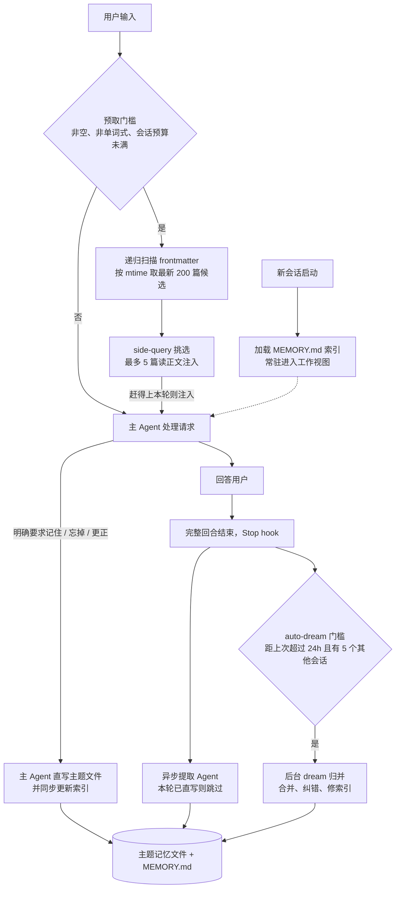
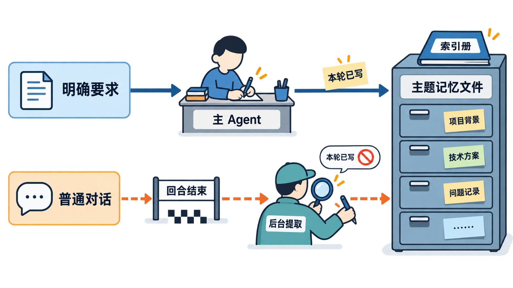
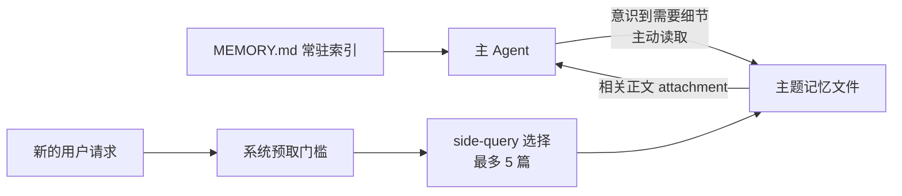

《源码解剖（一）》解释了 Claude Code 如何在单个长任务里维持一份可恢复的工作视图。但那一层只覆盖「任务进行中」：任务结束、窗口清空、进程退出之后，模型回到彻底失忆的状态。上周告诉它「这个仓库用 bun，不要用 npm」，今天新开一个会话，模型对这条约定一无所知。这篇文章研究剩下的一半：上周的约定被存成了什么、存在哪里，又在什么时机回到模型窗口。

研究对象是 Claude Code 的 **auto-memory** 跨会话记忆实现，与上一篇同一份源码材料。我最初以为，Claude Code 会像不少带长期记忆的 Agent 一样：把事实写进 SQLite 之类的存储，再依赖向量检索把相似内容找回来。源码给出的答案朴素得多：跨会话记忆是一组按项目隔离的 Markdown 主题文件，加一份 `MEMORY.md` 索引。

但「用文件存记忆」不等于简单地把笔记塞回模型窗口。Claude Code 在文件之上搭了一条「索引常驻、正文按需召回」的读取管道，又用「单文件原子写、跨文件最终一致、低频归并」处理写入后的秩序。它的容量设计处处克制：索引 200 行、候选 200 篇、单轮注入 5 篇、会话预算 60KB。这些数字共同指向同一个定位：auto-memory 只服务**少量、稳定、不可从当前代码推导的长期协作事实**，它不是知识库，也不是通用 RAG。

把这次阅读中被源码推翻的三条直觉先放在一起，后面的机制才不会变成一串名词：

| 读源码前的直觉 | 源码实际实现 | 这个差异意味着什么 |
|---|---|---|
| 长期记忆大概是 SQLite 加向量检索 | 四类 Markdown 主题文件，加一份 `MEMORY.md` 索引 | Claude Code 优先选择项目隔离、可读可审计的协作记忆 |
| 召回应是 Agent 自己查或系统自动塞入，二选一 | 索引给 Agent 留下拉取入口，`side-query` 又会自动预取正文 | 系统同时对抗「Agent 忘了查」和「自动注入过多」两类失败 |
| 记忆存得下，以后就总有机会找回来 | 索引 200 行、候选 200 篇、单轮最多 5 篇、会话预算 60KB | Claude Code 管理的是有限的自动召回工作集，不是全量历史 |

## 这篇文章会建立什么认知框架

先给 auto-memory 一个最小定义：它是 Claude Code 的跨会话记忆功能，主 Agent 在协作过程中把值得长期保留的协作事实写成按项目隔离的 Markdown 文件；未来会话启动时加载一份常驻索引，用户请求到来时由一次独立的小型模型查询挑选相关正文注入窗口。结果是一条上周的信息，可以在今天的新会话里不靠人工粘贴重新出现在模型面前。

记忆机制很容易被讲成一堆名词：MEMORY.md、主题文件、提取 Agent、召回、dream。本文不逐个名词解释，而是按「一条信息怎样跨会话存活」的生命周期展开。这里的生命周期不是指信息在业务上何时产生和消失，而是指一条信息从出现在对话里，到在未来会话被复用，中间要经过哪些处理阶段——每个阶段是谁、在什么时机、对记忆文件做了什么。

| 生命周期阶段 | 对应机制 | 它解决什么 |
|---|---|---|
| 存储 | 按项目隔离的 Markdown 目录，四类主题文件 | 记忆放在哪，按什么隔离 |
| 写入 | 主 Agent 直写 + Stop hook 异步提取 | 信息怎么进入记忆 |
| 召回 | 常驻索引 + side-query 按需选择 | 记忆怎么在合适时机回到模型窗口 |
| 保鲜 | mtime 驱动的三个离散机制 | 陈旧记忆如何被标记、淘汰 |
| 归并治理 | 容量上限与 auto-dream | 膨胀、重复、冲突怎么收场 |

本文沿「存储 → 写入 → 召回 → 保鲜 → 归并治理」的顺序推进，每一节回答一个阶段的问题，并交代上一节遗留了什么。本文希望能够回答这些问题：

- 记忆实际存放在哪里，按什么粒度隔离，哪些信息不该进记忆。
- 用户明确说「记住」时发生什么，没人要求记住的有用信息又是怎么进记忆的。
- `MEMORY.md` 常驻为什么还不够，召回为什么用一次小型模型查询而不是向量检索。
- 过期、重复、膨胀和并发写入，分别由哪个机制收敛，收敛到什么程度为止。
- 哪些场景超出了这套机制的设计容量。

表里有一个横跨多行的机制要先说明：**auto-dream** 不产生新记忆，但它同时收拾写入阶段留下的重复、保鲜阶段没处理完的矛盾和跨文件不一致。把它只理解成「定时清理」会漏掉它在这套架构里承担的一致性兜底角色。

从一条信息的完整旅程看，五个阶段接在这样一条链路上：



这张图先记住两点就够了：索引常驻但正文不常驻；写入有两条路，最后汇合到同一组文件。下面的章节沿这条链路顺序拆开。

---

## 记忆放在哪，按项目隔离的 Markdown 目录

存储层回答的是「放在哪、按什么隔离、存什么不存什么」。auto-memory 的记忆全部落在一组 Markdown 文件里，按项目隔离：

```text
~/.claude/projects/<项目根目录标识>/memory/
├─ MEMORY.md            # 常驻索引
├─ user_preferences.md  # 用户是谁、偏好什么
├─ feedback_workflow.md # 如何协作、哪些做法要避免
├─ project_context.md   # 不能从代码直接推导的项目背景
└─ references.md        # 外部信息去哪里查
```

隔离粒度是项目的 canonical Git root。相同仓库的不同 worktree 通常共享一套记忆；不同仓库通常相互隔离。这意味着它是**同项目跨会话记忆**，不是全局用户画像系统——即使是 `user` 类型的个人偏好，默认也不会自动传播到另一个项目。

存储内容按 frontmatter 中的 `type` 分为四类。frontmatter 是 Markdown 文件开头一段键值元数据，这里的 `type` 和 `description` 两个字段不只是给人看的标签，它们是后面召回阶段做选择的依据。

| type | 记什么 | 例子 |
|---|---|---|
| `user` | 用户身份与偏好 | 偏好中文、结论先行 |
| `feedback` | 协作方式与要避免的做法 | 提交前必须跑验证 |
| `project` | 不可从代码推导的项目背景 | 「线上环境与测试环境配置不同」 |
| `reference` | 外部信息的查找入口 | 缺陷在 Linear 的 INGEST 项目跟踪 |

这四类不是一套通用的人类长期记忆分类，而是编码协作场景的最小分类：`user` 保存如何与这个人协作，`feedback` 保存协作过程中形成的工作纪律，`project` 保存代码本身无法说明的项目约束，`reference` 保存工作之外的信息入口。它们的共同点不是「重要」，而是会在下一个编码会话里改变 Agent 的行动，却不能可靠地从当前仓库重新推导。

这也解释了 auto-memory 与相邻载体的边界：

| 载体 | 谁维护 | 如何进入模型窗口 | 适合承载什么 |
|---|---|---|---|
| `CLAUDE.md` | 人工维护 | 每轮常驻 | 稳定、明确、希望每次都遵守的项目规则 |
| auto-memory | 主 Agent 与后台提取共同更新 | 索引常驻，主题正文按需进入 | 跨会话形成、但不必每轮出现的协作事实 |
| 项目文档或知识库 | 团队或专门系统治理 | 按需检索 | 大规模、正式、需要长期归档或可靠查询的知识 |

同样重要的是**不该存什么**：代码结构、文件路径、Git 历史、临时任务状态、调试配方，以及已写入 `CLAUDE.md` 的内容，原则上都应从当前项目状态重新获取。

> **工程解读**：这条排除清单和 `CLAUDE.md` 的分工放在一起看更清楚。`CLAUDE.md` 是人工维护、每轮常驻注入的项目规则；auto-memory 是系统自动沉淀、按需召回的协作事实。两者共同的前提是「不可从当前代码推导」——能从代码里重新读出来的信息放进记忆，不仅浪费容量，还会随代码演进变成与现实冲突的过期记忆。存储层本身不强制这条纪律，拦截靠提取 Agent 的类型判断和使用者自律。

## 怎么写进去，明确要求直写，潜在价值异步提取

存储结构是静态的，真正决定记忆质量的是写入时机：信息出现在对话里的时候，谁负责判断它值得留。当前实现是双通道——主 Agent 直写处理明确意图，Stop hook 异步提取补漏。

**第一通道，主 Agent 直写。** 用户明确提出「记住这个」「以后都这样做」「忘掉之前关于 X 的内容」「之前那条不对，应改成……」时，设计上要求主 Agent 当场读取并更新主题文件，同步更新 `MEMORY.md`，而不是留给后台补做。

这里有一个容易被忽略的实现细节，它决定了去重怎么做：

> **源码事实**：一次写入是否属于记忆操作，判断依据是 `Write`/`Edit` 的目标路径是否位于 auto-memory 目录内，而不是对文本内容的语义理解。后台提取器用同一条确定性规则判断主 Agent 本轮是否已写过记忆——扫描本轮实际工具调用记录，只要出现位于 memory 目录的写入，就跳过本轮提取，避免双通道重复落笔。

**第二通道，Stop hook 异步提取。** Stop hook 是 Claude Code 在一个完整回合结束时机执行的钩子。每个回合结束后，它可以启动一个后台的 `extract-memories` Agent：查看本轮新增对话，判断是否有值得跨会话保存的信息、属于哪种类型，然后扫描已有记忆的 frontmatter，优先更新相近主题文件而不是新建重复文件，需要时更新索引。它是异步、尽力而为的，正常回答不会为了等它而延迟。只有一个例外：一次性 `claude -p` 模式在输出最终回答后、进程退出前，会等待未完成的提取任务，默认最多约 60 秒——延迟的是进程退出，不是用户收到回答的时间。

这个双通道是一个影响系统边界的选择：

> **工程解读**：如果只保留异步提取，「记住 X」这类明确要求要等回合结束才落盘，用户无法确认它被执行；如果只保留主 Agent 直写，主 Agent 就得在每轮回答中途判断「这段值不值得存」，既拖慢回答，也容易漏掉没有明确指令的协作信号。双通道把确定性强、意图明确的写入留在主路径，把低置信度的潜在价值交给回合结束后补漏，两条通道用同一条路径判据去重。代价是写入时序变得不确定，一致性压力被推给了后面的归并环节。

这一层没有保证的是：异步提取可能失败、可能遗漏，「值得保存」的判断本身也是模型判断。漏掉的信息不会报错，它只是没有发生。



> 图：用户明确提出记忆要求时，主 Agent 立即写入主题记忆文件并更新索引；普通对话则在回合结束后交给后台提取。若主 Agent 本轮已经写过记忆，后台提取会跳过，避免双通道重复落笔。

## 怎么被想起来，常驻索引加按需语义召回

写进去不等于用得上。这是召回层存在的理由。

这里是我读源码时第二次修正直觉的地方。我原先把记忆召回想成二选一：要么主 Agent 自己意识到要查旧资料，再主动读取；要么系统替它找好内容，直接塞进窗口。Claude Code 同时保留了两条路：`MEMORY.md` 给主 Agent 留下可追溯的拉取入口，`side-query` 则在满足条件的新请求到来时，异步挑选相关正文并自动注入。前者可以称为 **Agent 拉取（pull）**，后者是 **系统预取（push）**；两者不是重复，而是在补不同的失败模式。

`MEMORY.md` 是每次会话启动时自动加载的常驻入口，设计约束很紧：最多 200 行、约 25KB，每项通常一行，指向主题文件并附一句摘要，超限时只加载前一部分并附加截断警告：

```text
- [用户协作偏好](user_preferences.md) — 偏好中文、结论先行、技术说明需有证据。
- [验证要求](feedback_workflow.md) — 完成工程改动前应运行相关验证。
- [外部系统](references.md) — 线上缺陷在 Linear 的 INGEST 项目跟踪。
```

它的角色是「我大概记得什么、应该去哪里找」，正文在主题文件里。`MEMORY.md` 因此解决的是**可追溯性**：主 Agent 至少知道哪些主题存在，也可以在推理过程中主动打开相关文件。但只有索引仍然不够：一行摘要未必能让主 Agent 主动展开正确的文件，而主 Agent 同时要理解问题、规划、调用工具、组织回答，很可能根本没想起去查。

这正是 Claude Code 不只依赖 Agent 拉取的原因。只用拉取，系统很省，但「模型忘了调用检索工具」是一种不会报错的静默失败；只用系统推送，则每条用户输入都可能多一次检索、把不相关的背景塞进窗口，还会把选择错误变成对主 Agent 的干扰。Claude Code 的组合方式不是把两套机制叠加，而是让它们各自承担一个边界：索引使记忆可由 Agent 解释和追查，预取只在满足门槛时弥补 Agent 的遗漏。

| 召回路径 | 它避免的失败 | 它仍要付出的代价 |
|---|---|---|
| Agent 依据 `MEMORY.md` 主动拉取 | 不必每轮自动检索；主 Agent 可以按任务需要追查原始主题文件 | 主 Agent 可能没意识到该查，或选错文件 |
| `side-query` 系统预取 | 相关约定不会因主 Agent 忘记检索而静默失效 | 增加旁路模型调用；可能选错、来不及赶上首轮，或污染窗口 |
| 两者结合 | 既保留可追溯入口，又对高价值遗漏做有限补偿 | 需要门槛、候选上限、注入预算和去重来约束复杂度 |



这张图的重点不是两条箭头都能读文件，而是**启动条件不同**：主 Agent 的读取依赖它在推理中自觉发起；系统预取由用户请求和预算门槛确定性启动。Claude Code 没有让其中一条取代另一条，因为它们各自承担了另一条无法覆盖的失效模式。

**预取触发是确定性门槛，不是模型判断。** 一个用户新请求要触发召回，需要全部满足：auto-memory 已启用、相关召回开关启用、存在真实用户输入、输入非空、输入不是「单词式」请求、当前会话累计自动注入的记忆正文未达 60KB。

其中「单词式」的判断值得单独拎出来：

> **能力边界**：当前实现判断「单词式」用的是「是否包含空白字符」这条粗糙规则，它明显偏向英文。中文请求通常没有空格分隔，「为什么这样设计」这样的完整问题可能因此不触发预取。这是当前实现的语言适配缺陷，使用中文的用户不能默认召回总会发生。

**候选筛选和选择是一条五步管道：**


side-query 是独立于主对话的一次小型模型查询（研究样本中由 Sonnet 执行）：把用户问题和候选清单交给它，由它判断哪几篇与当前请求相关。它选出的正文作为 `relevant_memories` 注入主 Agent 上下文；最后修改时间超过 1 天的，附加一段陈旧提醒——这件事下一节展开。

这里还有一层容易和「写入去重」混淆的控制。写入去重发生在 Stop hook：主 Agent 本轮已经写过 memory 目录，后台提取就跳过。**召回去重**则发生在会话内：`side-query` 选出的文件还会经过当前文件读取状态与历史 `relevant_memories` attachment 的过滤，已经在当前上下文里出现过的主题文件不会反复自动注入。这个记录不是另一份长期记忆文件，而是当前会话的状态；上下文压缩后，旧 attachment 不再保留，相应的已召回集合与 60KB 自动注入预算都会重置，之后同一主题可以再次被召回。这样做是必要的：Compact 之后主 Agent 不再真正持有那段正文，永久禁止重读反而会制造新的遗忘。

> **工程解读**：这里把 Compact（将旧对话压缩并重建工作视图）视为一次上下文可用性的边界。Compact 前，同一主题已经作为 attachment 留在当前工作视图里，重复注入只会浪费窗口；Compact 后，那份 attachment 已不在新的工作视图中，继续沿用旧的去重记录反而会阻止关键事实回来。Claude Code 因此接受同一主题在一个很长的任务里、跨越不同 Compact 阶段后**可能再次消耗 token**，换取压缩后的任务仍能恢复长期协作事实。这里的“可能”很重要：主题还要重新通过候选上限、`side-query` 选择与异步时序，系统并不保证每次都会再次注入。

> **源码事实**：相关召回的主链路集中在 `src/memdir/memoryScan.ts` 与 `src/memdir/findRelevantMemories.ts`：扫描主题文件前 30 行 frontmatter，按 mtime 取最多 200 个候选，再由 side query 选择最多 5 个文件。预取启动与 `relevant_memories` attachment 的消费位于 `src/utils/attachments.ts`；其中的读取状态与历史 attachment 过滤，负责避免同一主题在同一会话里反复自动注入。

在候选只有两三百条、每条只有一句 description 的规模上，这个选择是有意为之的。先把常见方案放在同一张表里，才能看清 Claude Code 选中的到底是什么：

| 方案 | 擅长什么 | 主要成本或盲区 | 当前研究样本中的位置 |
|---|---|---|---|
| 主 Agent 依索引主动读取 | 低开销、可解释、可追查原文件 | Agent 可能忘记查；摘要不足以判断具体内容 | `MEMORY.md` 提供入口 |
| 关键词检索 | 路径、ID、报错、配置键等精确术语 | 换一种说法就可能漏掉语义相关内容 | 不是自动召回的主方案 |
| 向量或混合检索 | 大量材料中的语义匹配，并可与精确检索组合 | embedding、索引同步、重建、排序与数据治理 | 当前样本未采用 |
| 小模型 `side-query` 选择 | 小候选集内直接理解问题与摘要的关系 | 每次预取多一跳模型调用，质量依赖 description | 当前样本的系统预取机制 |

> **工程解读**：Markdown 文件与向量检索并不是非此即彼：系统完全可以把 Markdown 当作可审计的事实源，再为它建立向量索引。向量检索的价值在于，当资料规模很大、提问与原文措辞差异很大时，仍能找出语义相关内容；但查路径、配置键、报错文本或编号时，通常还需要关键词、元数据过滤或混合排序。当前研究样本没有走这条索引管道：候选只有两三百条、每条只有一句 description，side-query 用一次小型模型调用就买到了语义匹配能力。它避开了嵌入、索引同步与重建的维护成本，代价是每个符合条件的请求多一跳延迟，且召回质量依赖 description 写法。关键词匹配在这个规模下更轻，却会错过「换一种说法的同一需求」；把候选正文全量注入最简单，却会撞上会话预算并把无关记忆带进窗口。若记忆规模增长到数千条、需要稳定的全局检索，这个取舍需要重新评估，届时混合向量方案才真正进入适用区。

还有一个时序事实需要明确：

> **源码事实**：预取与主 Agent 的首次生成并行运行。若主 Agent 一轮直接完成回答，没有下一次模型调用，预取即使稍后完成也不会为此阻塞本轮——召回结果赶不上第一轮，只能惠及后续轮次。

把这一层放回全链路，它的结构像极了操作系统的按需分页：页表常驻内存，页面在被真正访问时才调入。`MEMORY.md` 是那张常驻的「页表」，主题文件是磁盘上的「页」，side-query 扮演判断「这次访问需要哪些页」的角色。这个类比会在结尾补全它的关键差异。


> 图：模型工作台常驻的只有一张目录卡；每个新问题到来时，`side-query` 根据主题文件摘要挑选最多 5 份相关正文，在会话预算允许时作为临时 attachment 注入工作视图。

## 记忆怎么过期，三个离散机制替代一条衰减曲线

召回保证了「找得到」，但找到的可能是过时的。记忆是时点观察，不是活状态——三个月前记下的「部署脚本在 scripts/ 下」，可能今天已经不成立。

当前实现没有采用平滑的时间衰减打分（类似 `relevance × exp(-age / half_life)` 的方案），时间治理由三个离散机制共同承担，驱动它们的都是同一个字段——文件最后修改时间 mtime：

| 机制 | 作用时机 | 做什么 |
|---|---|---|
| 候选集截断 | 每次召回筛选 | 只从最新 200 篇候选中选，老文件直接失去被选资格 |
| 陈旧提醒 | 注入时 | 超过 1 天的记忆附加验证提醒 |
| dream 归并 | 低频触发 | 处理被推翻、失效、互相矛盾的记忆 |

超过 1 天的自动召回记忆会带上类似这样的提醒（原文片段）：

```text
This memory is 47 days old.
Memories are point-in-time observations, not live state.
Verify against current code before asserting as fact.
```

> **能力边界**：这三个机制衡量的都是**文件最后修改时间**，不是事实发生的时间。一条被改写过的事实会显得「新鲜」，一条没被碰过但仍然正确的事实会显得「陈旧」。mtime 能管理文件的活跃度，管理不了事实本身何时失效——后者仍然依赖 dream 的语义整理和模型使用记忆时的验证意识。

三个机制没有解决的那个问题也在这里：候选截断只淘汰「不活跃」的文件，陈旧提醒只提示「去验证」，真正删除或修正过期内容要等 dream。时间保鲜在当前实现里是提醒制，不是强制制。

## 记多了怎么办，200 是召回容量而不是存储上限

时间机制处理单条记忆的过期，处理不了集合层面的膨胀。这里还有第三个让我印象很深的取舍：我原先会自然地把「记忆存得下」理解为「以后总有机会被找回来」。Claude Code 把这两件事明确分开了。记忆文件可以继续增长，但自动召回从一开始就被分层限额约束：

```text
磁盘上的主题文件：可以继续增加
        ↓
MEMORY.md 常驻索引：最多 200 行 / 约 25KB
        ↓
自动召回候选：按 mtime 只保留最新 200 篇
        ↓
side-query 选择：单轮最多 5 篇
        ↓
单篇正文：最多 200 行 / 4KB
        ↓
单会话自动注入：累计最多 60KB
```

其中三个「200」分别在索引、候选与单篇正文三个层面划定边界：

- `MEMORY.md` 超过 200 行，后面的索引项不会被加载进上下文——它们成了写给了没人看的目录；
- 自动召回只从 mtime 最新的 200 篇候选中选择——更老的文件即使内容相关也不会被召回；
- 递归扫描仍会读取**全部** `.md` 文件的 frontmatter，所以大量文件即使不被召回，也会拖慢每次符合条件请求的召回前置步骤。

这条「最新 200 篇」的规则看起来简单，甚至有些粗暴：低频但重要的记忆可能因长期未修改而失去候选资格。它背后的判断却很明确——Claude Code 不承诺检索所有历史，而是把可用的自动召回额度优先给最近仍在活动的主题。换言之，mtime 在这里不是事实正确性的证据，而是一个便宜的「仍可能影响接下来协作」代理指标。

若要让大量低频历史也能稳定地按语义、精确词和元数据被找回，就需要另一套更重的索引、排序与更新治理；那已经是知识库或通用 RAG 的问题，不再是这个小型协作工作集的目标。Claude Code 选择的不是最精细的历史管理，而是把有限的上下文与推理预算留给当前仍活跃的工作集。这也是为什么 200 不是“存储上限”，而是“默认自动召回值得花多少预算”的答案。

> **源码事实**：`src/memdir/memoryScan.ts` 负责按 frontmatter 和 mtime 扫描候选；它只读取每份主题文件开头的有限行数，而不是先把全部正文读进来。候选上限、单篇读取上限和会话自动注入预算分别把目录扫描、正文读取和上下文装配限制在不同层次。

第三条有一个容易踩的坑：把旧文件移进 `memory/archive/` 并不能减轻扫描压力，因为现实现的扫描是递归的，archive 子目录里的文件照样进扫描范围。

所以治理 auto-memory 的正确姿势，是把它当一个小而活跃的工作集来维护，而不是当仓库囤积：

1. **主题聚合，不一条事实一个文件。** `use_bun.md`、`no_npm.md`、`no_yarn.md` 三个文件应合并成一个 `tooling_preferences.md`——同类事实更新同一个文件，既省候选名额，也让 dream 更容易维护。
2. **只留仍会影响未来协作的内容。** 四类记忆都遵循这个标准，过期内容及时出清。
3. **区分过期与低频。** 被推翻、失效的，删除或改正；有价值但低频的，移出 auto-memory 根目录，交给项目文档、Git 历史或外部知识库——注意是移出 memory 目录，而不是挪进子目录。
4. **索引只放活动主题。** `MEMORY.md` 是导航，不是历史流水账。
5. **接近上限前主动整理。** 在活动主题文件约 150 篇时运行 `/dream` 并检查结果，而不是等到索引已经截断才发现超容。
6. **大规模知识与 auto-memory 分离。** 如果需要维护数千条长期可查询的事实，应使用数据库、向量检索或正式知识库——Markdown 文件加 LLM 筛选不是那个场景的架构。

## 两个会话同时写怎么办，单文件原子，跨文件最终一致

前面的机制都默认只有一个会话在碰记忆目录。现实是：同一个仓库可以开多个 Claude Code 会话，加上异步提取 Agent 和 dream，同一组文件上有多路并发读写。这一层处理的是并发下的正确性。

**单文件写入是原子的。** 每次写入走临时文件加改名：

```text
目标：user_preferences.md

1. 写入临时文件 user_preferences.md.tmp.<pid>.<time>
2. flush 确保临时文件内容落盘
3. rename(temp, user_preferences.md)
```

`rename` 直接替换同名旧文件。正常情况下，并发读者看到的要么是旧完整版本，要么是新完整版本，不会读到写到一半的正式文件。若进程在临时文件阶段被终止，旧正式文件一般仍然安全，代价是可能残留一个临时文件。

**会话之间靠乐观并发控制。** `Edit`/`Write` 执行前会比较 Agent 上次读取时的文件状态与当前磁盘状态，不一致就拒绝写入：

```text
读取 A.md
→ 其他会话修改了 A.md
→ 当前会话试图用旧上下文写 A.md
→ 工具报「文件意外被修改」
→ Agent 应重新读取、合并、再编辑
```

工具不会自动做三方合并，解决冲突是 Agent 的责任。

**多文件操作不是事务。** 主题文件和 `MEMORY.md` 是两次独立的文件操作，「主题文件写成功、索引更新失败」会产生没被索引的孤儿记忆；反过来「索引指向新文件、新文件创建失败」会产生死链。

> **决策结论**：当前样本的完整一致性模型是——单文件用原子替换加乐观并发控制，跨文件靠最终一致，语义去重依赖 Agent 判断与 dream 整理。它换来的是实现简单和人工可修复，付出的是孤儿与死链需要在整理阶段被收拾。

把这些保证放在一起，auto-memory 的可靠性边界会更清楚：

| 问题 | Claude Code 提供的保证 | 它没有保证什么 |
|---|---|---|
| 单个主题文件被写到一半 | 临时文件加 `rename`，读者通常只会看到旧完整版本或新完整版本 | 临时文件可能残留 |
| 两个会话基于旧内容改同一文件 | 乐观并发控制拒绝陈旧写入 | 不会自动完成三方合并 |
| 主题文件与 `MEMORY.md` 同步 | 后续 dream 或人工可整理到一致状态 | 没有跨文件事务，可能暂时出现孤儿与死链 |
| 重复、矛盾、过期信息 | 低频 dream 尝试归并与修复 | 不保证立刻触发、每次成功或实时收敛 |

收拾这件事的机制就是 **auto-dream**。它不是常驻定时任务，只有 Claude Code 进程仍在运行、且主会话完成一个回合后，才检查触发条件：auto-memory 与 auto-dream 均已启用、距上次整理至少 24 小时、期间至少有 5 个其他会话、没有另一项 dream 正在运行、不处于 KAIROS 模式。满足后启动后台 Agent 执行归并：合并同一主题的重复内容、把新事实并入既有主题、修正或删除被新信息推翻的内容、清理失效链接、缩短过长索引项、把 `MEMORY.md` 拉回限额之内。并发防护靠 `.consolidate-lock` 锁文件（内容含 PID，文件修改时间兼作上次整理时间戳），崩溃后的死锁可被后续进程回收。

两个设计选择值得分开看。触发策略上，定时器方案要求进程常驻，而 Claude Code 的生命周期由用户会话决定，进程退出后没有任何东西可以执行检查；把检查挂在回合结束的时机上，成本搭在已有活动上，也符合它「最终一致」而非「实时保障」的定位。一致性模型上：

> **工程解读**：把主题文件与索引的更新包进跨会话的全局事务，可以消灭孤儿与死链，但要在多个并行会话之间加锁协调，对一组人可读、可手工修复的 Markdown 文件来说复杂度过高。当前场景写入频率低、冲突窗口小、异常状态人工可查，所以单文件原子加最终一致是匹配约束的选择。 dream 只协调它自己——它不把主 Agent 直写、异步提取和多会话写入纳入任何全局事务。

> **源码定位**：auto-dream 的门槛和调度在 `src/services/autoDream/autoDream.ts`，归并提示与动作定义在 `src/services/autoDream/consolidationPrompt.ts`，`.consolidate-lock` 的互斥与失效回收由 `src/services/autoDream/consolidationLock.ts` 处理。

## 旁支机制，KAIROS 长会话为何改成日志优先

KAIROS 是研究样本中的一种特殊长会话模式（默认不启用），不是前文默认生命周期的必经环节。把它放在主线之后，是因为它没有改变 auto-memory 的最终落点，只改变了「信息先以什么节奏落盘」：值得记忆的信息先按日追加到 `logs/YYYY/MM/YYYY-MM-DD.md` 日志文件，不频繁改写主题文件和索引；之后由显式触发的 `/dream` 把日志蒸馏成主题记忆并更新索引。

这把单次写入成本压到了最低，适合长期持续运行的会话；代价是在蒸馏完成前，这些信息以流水日志而非结构化主题的形式存在，与常规「即时主题文件 + 索引更新」的链路是两套节奏。它再次印证了这套系统的设计倾向：写入可以妥协，一致性靠事后的归并收敛。

---

## 结论，auto-memory 是协作上下文层，不是知识库

回到开头的问题：上周的约定凭什么在今天生效。答案是它先被双通道写进按项目隔离的 Markdown 文件，再由常驻索引提供方向感、由 side-query 在合适的请求到来时把正文送回模型窗口，中间由 mtime 三机制标记过期、由 dream 低频收敛重复与矛盾。源码阅读最终修正了我对「长期记忆」的想象：Claude Code 没有试图让模型保存一座可全量检索的历史仓库；它保留 Agent 自己查阅记忆的入口，再用受预算约束的系统预取，补上 Agent 没想起去查时的缺口。

开头那三条被推翻的直觉，其实是同一个设计取舍的三个侧面：用 Markdown 而不是把向量索引当作默认基础设施，是为了让事实以项目为边界、可被人直接审阅；同时保留拉取与预取，是因为记忆既要能被 Agent 追查，也不能完全依赖 Agent 自觉；把候选、单篇与会话预算逐层卡住，则承认自动召回本身是一种稀缺能力。Claude Code 的 auto-memory 因此不是“记住得越多越好”的系统，而是“让下一次协作刚好不必从零开始”的系统。

整套架构的取舍可以压缩成一行：

```text
项目级隔离 + Markdown 可读可审计
+ 主 Agent 即时直写 + Stop hook 异步补漏
+ 常驻索引 + side-query 按需语义召回
+ dream 低频归并
+ 单文件原子写、跨文件最终一致
```

现在可以补全按需分页那个类比的同构与差异了。auto-memory 的结构与操作系统的虚拟内存管理确实同构：常驻索引对应页表，side-query 召回对应按需调页，200 篇候选与 60KB 预算对应工作集上限，dream 对应后台的页整理。但差异是实质性的：硬件的缺页由地址访问确定性触发，而「这次该想起哪些记忆」由一次模型调用判断，判断失准不会报错，只会安静地漏掉一段本该出现的上下文——再加上中文预取门槛、mtime 与事实时间的错位、跨文件无事务，这套机制没有一个环节是硬保护的。

所以它的适用边界要严格对待。适合保存的是少量、稳定、不可从当前代码推导的长期协作事实。不适合承担的是全量代码知识库、大规模项目历史档案、严格事务型状态存储、数千条高可靠且需全局检索的记忆。工程上最有效的对应做法，是把 auto-memory 当作操作系统中**工作集**的概念来管理——保持小而活跃，主动淘汰，而不是囤满一个仓库。

> Claude Code auto-memory 是 Agent 的长期协作上下文层，而不是项目知识库或通用 RAG 数据库。

---

## 研究说明

- 研究对象：Claude Code 的 auto-memory 实现，与《Claude Code 源码解剖（一）上下文》同一份源码研究材料（2026 年 3 月快照），成文于 2026 年 9 月。
- 文中阈值（200 行 / 25KB 索引、200 行 / 4KB 单篇注入、200 篇候选、5 篇选择、60KB 会话预算、30 行 frontmatter、1 天陈旧提醒、24 小时 + 5 会话 dream 门槛、60 秒 `claude -p` 等待）均来自该研究样本，未逐项复核最新版本，后续版本可能调整。
- auto-dream、extract-memories、side-query、KAIROS 等命名按研究样本中的实现称呼；KAIROS 与 auto-dream 属于开关控制或特殊路径，默认不启用。

关键结论的源码定位如下。路径用于回查这份研究快照；后续版本的目录与行号可能已经变化：

| 机制 | 研究样本中的主要源码位置 |
|---|---|
| 主题文件扫描、frontmatter、mtime 与 200 篇候选 | `src/memdir/memoryScan.ts` |
| `side-query` 选择、最多 5 篇与选择提示 | `src/memdir/findRelevantMemories.ts` |
| 异步预取、`relevant_memories` 注入、会话内去重 | `src/utils/attachments.ts` |
| 常驻索引和记忆工作流说明 | `src/memdir/memdir.ts` |
| auto-dream 门槛与调度 | `src/services/autoDream/autoDream.ts` |
| dream 归并与锁 | `src/services/autoDream/consolidationPrompt.ts`、`src/services/autoDream/consolidationLock.ts` |
