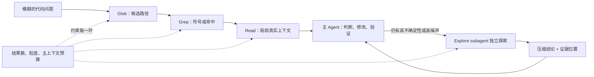
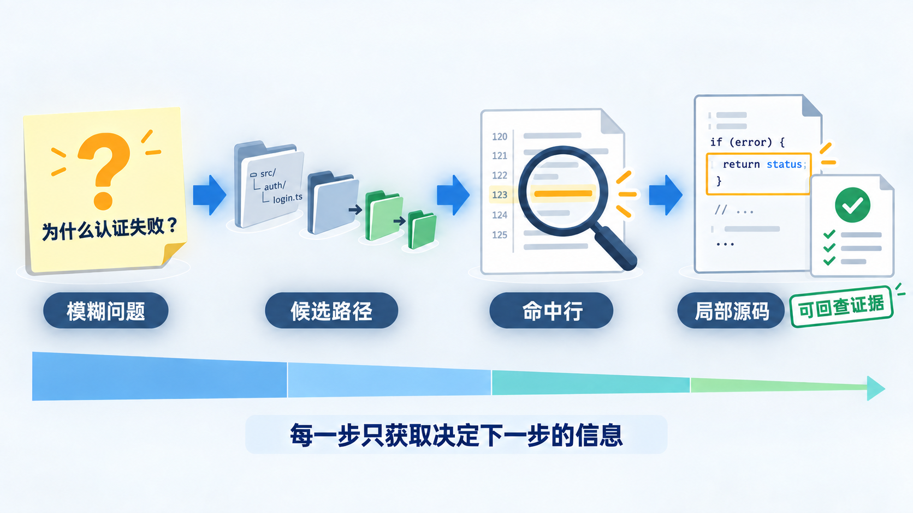
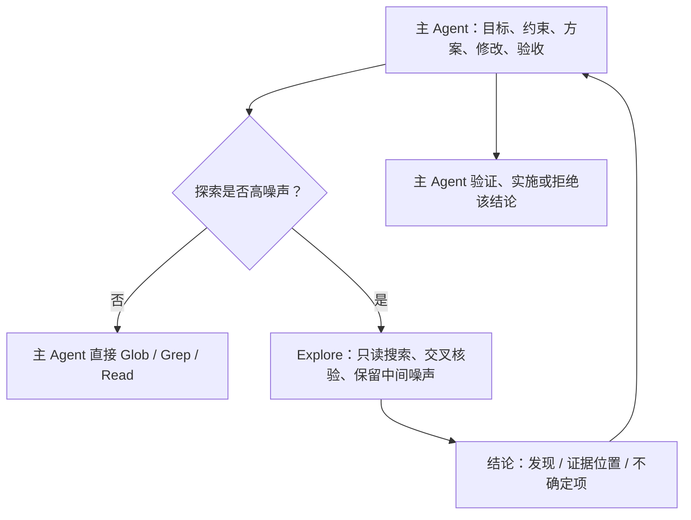
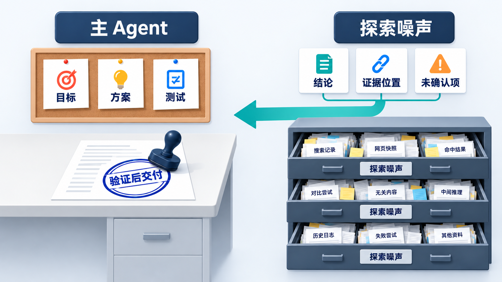

# Claude Code 源码解剖（四）：代码探索不是 RAG，而是受约束的证据循环

前面三篇文章分别讨论了 Claude Code 怎样维持一份可恢复的工作视图、怎样把跨会话协作事实存到文件系统、怎样让多个 Agent 在同一任务上协作。它们都绕不开一个更早的问题：**模型面对一个陌生代码库时，第一条可靠的事实从哪里来？**

一个常见回答是 RAG：把代码切块、建向量索引，再从 Top-K 结果里挑上下文。但这并不是编码 Agent 唯一、也未必是默认最合适的起点。公开的 Claude Code 代码检索解析展示的是另一条路径：模型不先获得“一批系统替它选好的代码”，而是把一个尚未定位的代码问题，逐步变成路径、命中、局部源码和可执行判断。

因此，这篇文章想提出的判断是：**Claude Code 的 Glob、Grep、Read 不是三个方便的命令包装，而是一套受约束的证据循环。它把“我不知道该看哪里”拆成一连串成本递增、证据增强、可回查的操作；当这条循环本身会吞掉主任务的注意力时，再把探索隔离到 subagent。**

这里讨论的是公开解析所描述的检索工具设计，以及当前官方文档中的 Explore subagent 行为；它不是对当前发行版全部源码的逆向结论。工具上限、默认模型和具体行为都会随版本变化。

## 这篇文章会建立什么认知框架

先定义本文跟踪的对象：**一项待回答的代码问题**。例如，“认证失败为什么没有被正确处理？”它一开始只有自然语言描述，既没有确定文件，也没有确定符号，更谈不上修改方案。

这项问题在探索中会经历五次状态变化：

| 问题的状态 | 主要机制 | 本阶段阻止的失败 | 留给下一阶段的压力 |
| --- | --- | --- | --- |
| 模糊、没有候选范围 | Glob | 一开始把整个仓库塞进窗口 | 路径相关不等于逻辑相关 |
| 已有候选文件 | Grep | 在每个候选文件里盲读 | 命中行还没有调用语义 |
| 已有符号或命中位置 | Read | 只凭单行匹配下结论 | 局部阅读会产生中间结果积累 |
| 已形成证据链 | 主 Agent 判断、编辑与验证 | 把搜索结果误当成答案 | 开放式探索可能反过来淹没主任务 |
| 探索噪声过大 | Explore subagent | 主上下文被日志、失败搜索和旁枝占满 | 子 Agent 的摘要仍需要被验证和接入验收 |

这不是“先 Glob、再 Grep、再 Read”的死板命令顺序。已知精确路径时，可以直接 Read；已知符号时，也可以先 Grep。它描述的是一条更一般的原则：**每一步只购买足以决定下一步的信息。**

本文会沿“缩小候选 → 取得局部证据 → 管理探索预算 → 隔离高噪声探索 → 接回 Harness”的顺序推进，希望回答四个问题：

- 为什么本地代码探索不应一开始就等同于 RAG。
- Glob、Grep、Read 分别让代码问题获得了什么新的、可核验的状态。
- token 上限为什么不是能力削弱，而是探索接口的一部分。
- subagent 吸收了什么，为什么它不能替主 Agent 对结论和交付负责。

先看整条链路：





*图：代码探索不是一次性召回全仓，而是每一步只取得足以决定下一步的信息。图为机制解释，不对应特定版本的 Claude Code 工具界面。*

图中最容易被忽略的是底部那条预算线。没有它，前面只是四种工具；有了它，才是一条能在长任务里重复运行的探索协议。

---

## 第一关不是召回答案，而是把仓库缩成可检查的候选空间

RAG 的典型路径是“代码切块 → embedding → Top-K 召回”。它适合的问题是：系统已积累大量、更新较慢、用户表达又比较模糊的资料，先由检索层提供语义相近的入口。

但本地编码任务经常不是这个形态。用户说“修改 `getUserById`”“检查 `AUTH_401`”，要的是符号、路径、调用点和当前工作树里的真实代码。语义相近的片段可以提供线索，却不能替代确定定位。更麻烦的是，代码改动后，向量索引必须重建、增量更新，或者接受陈旧；直接搜索当前磁盘没有这层新鲜度债务。

> **工程判断**：RAG 不是代码探索的反面。它更适合跨仓库、跨文档、低频资料或模糊发现；而在单仓库、实时、需要精确落点的任务里，路径、符号和文本检索应先承担“建立事实坐标”的职责。

Glob 处理的是最前面的不确定性：问题还不知道在哪些文件里。以 `**/*login*.{ts,tsx}` 为例，模型得到的不是代码正文，而是一小组候选路径。公开解析描述的研究样本会优先呈现最近修改的文件，且把返回数量限制在 100 个以内。

这类限制的意义不在于让工具“少做一点”。它迫使模型在候选过多时继续收紧模式，而不是把几千条路径带进工作视图后再靠注意力硬挑。问题到这里从“整个仓库都可能相关”，变成“这些文件值得继续证实”。

Glob 仍没有回答逻辑在哪里。文件名相近可能只是测试、旧实现或文档，因此下一关需要从路径坐标进入内容坐标。

## 第二关，把候选文件变成可回查的命中，而不是相似片段

Grep 的价值不是“能搜字符串”，而是它让模型按不确定性选择返回粒度：先知道哪些文件命中，再知道每个文件命中多少次，最后才看具体行。

```text
路径名单
  → 每个文件的匹配计数
    → 带文件名与行号的命中行
      → 围绕该行的局部源码
```

假设模型在认证模块中搜索 `AUTH_401`。先返回文件级结果，足以判断错误码是集中定义还是多处散落；计数能提示某个文件是定义点还是密集处理点；最后带行号的命中，才为下一步 Read 提供稳定锚点。每一次升级都增加信息，也同时减少下一次读取的盲目性。

> **机制事实**：公开解析将 Grep 的输出概括为文件级、计数级和内容级三个层次；无论底层是否严格返回 JSON，关键是结果稳定携带路径、行号、匹配数和文本这些可被下一次调用消费的字段。

这与“先召回几段看似相关的 chunk”有一个本质差异：Grep 不替模型宣称哪段代码回答了问题，它只建立可验证的引用坐标。模型仍须在下一步阅读定义、分支、调用方和测试，才能判断一个命中到底是事实、注释、死代码，还是需要修改的位置。

所以，命中行不是结论，甚至还不是上下文。它只是把问题推进到了“该读哪一小段真实代码”。

## 第三关，Read 让证据进入上下文，但不允许它无边界涌入

Read 才真正把源码送进模型窗口。但“读文件”不是一个足够好的接口：一个文件可能几千行，关键函数只占几十行，而大文件全文会迅速挤掉任务目标、前序判断和验证结果。

公开解析描述的研究样本中，Read 默认最多读取 2,000 行，并支持 `offset` 与 `limit`。一个更符合证据循环的动作是：围绕命中行先读 80 行左右，确认函数职责和控制分支；若需要理解调用关系，再沿 import、调用点或测试向外扩展。

```text
命中：src/services/user.ts:42
  → Read 30–110：确认函数签名、分支与错误处理
  → Grep getUserById：寻找调用方
  → Read 调用点附近：确认错误如何被转换或吞掉
  → 读取相关测试：确认现有行为与验收缺口
```

这条路径有一个很朴素的好处：任何修改建议都可以回到“哪个文件、哪一行附近、哪条调用关系”去复查。它也解释了为什么专用工具比让模型每次自己拼 Bash 更适合作为默认通道：专用接口把忽略规则、编码、超时、输出截断、行号与结果结构收进一致的执行语义，并天然适合赋予只读权限。

> **能力边界**：小范围 Read 只降低了错误理解的概率，不保证理解正确。跨文件隐式依赖、动态调用、生成代码和过时测试，仍可能让局部证据指向错误结论；这也是为何“读到代码”之后还必须有验证阶段。

到这里，一项代码问题已经从模糊描述转成了局部证据链。但还有一个压力没有被任何单次调用解决：每次搜索都很克制，几十轮搜索加起来仍会侵蚀主 Agent 的工作视图。

## 预算不只是限流，它规定了信息如何升级

把 Glob 的文件数上限、Grep 的粒度选择和 Read 的行数上限看成互不相干的参数，很容易误解它们是在削弱模型。它们其实保护的是三层不同资源：

| 预算层 | 典型约束 | 它保护什么 | 超出后应发生什么 |
| --- | --- | --- | --- |
| 单次结果预算 | 文件数、命中数、读取行数 | 单次工具结果不压垮窗口 | 收紧模式、缩小范围、改为计数或局部读取 |
| 信息粒度预算 | 路径 → 计数 → 命中 → 源码 | 不为尚未需要的细节付 token | 由前一轮证据决定是否升级 |
| 主上下文预算 | 多轮搜索、日志、失败尝试的累计量 | 主任务仍保有目标、约束、方案和验收 | 把探索转交独立上下文，再回传压缩结论 |

前两层解决的是“这一轮别太大”，第三层解决的是“整个探索过程别取代任务本身”。这与第一篇的上下文工程直接相连：工具输出并不会因为单条很小，就天然不会造成长期累积。不同的是，那里治理的是任务运行中的全部工作视图；这里治理的是其中最容易膨胀的一类活动——不确定代码探索。

> **工程解读**：预算的真正作用是把探索从“尽量多找一些材料”改写成“每轮消除一个足以决定下一步的不确定性”。前者追求覆盖面，后者追求可控的证据增量。

当模型已经能提出正确的、少量的下一步查询时，主 Agent 自己探索通常更短、更连贯。反过来，若问题需要大量横跳、日志分析、分支比较或数十轮查询，继续把所有过程留在主窗口，反而会伤害最终判断。

## 高噪声探索要隔离，但不能把责任也外包

当前官方文档把 Explore 定义为面向代码库搜索与分析的只读 subagent：它在独立上下文窗口中工作，Write 和 Edit 被拒绝，探索结果不会塞满主对话。官方给出的使用理由很直接：当某个旁路任务会灌入大量搜索结果、日志或文件内容，而主任务之后并不需要逐字引用它们，就交给 subagent，最后只回传摘要。





*图：探索子 Agent 保留搜索记录、网页快照、失败尝试等过程材料；主 Agent 只接收结论、证据位置和未确认项，并独自承担验证与交付责任。图为工程解释，不对应特定版本的 Claude Code 工具界面。*

这不是简单的并行加速。Explore 的独立窗口承担的是**上下文隔离**：大量失败搜索、重复命中和旁枝阅读可以留在子 Agent 内部；主 Agent 获得的是足以继续决策的“发现 + 证据位置 + 未确认项”。这也与第三篇中的分层一致：Worker 可以横向执行，但最终交付仍应有一个责任中心。

官方文档还说明，Explore 是只读的，适合文件发现、代码搜索和代码库探索；其模型与默认行为会随版本调整。对项目自定义的探索 Agent 而言，更值得继承的是这个边界，而不是照抄某个模型名：只读工具、清晰的搜索任务、带证据位置的回传格式，以及必要时的轮数或成本上限。

可以把回传契约写得很小：

```text
结论：认证错误在 Controller 层被转换为 200 响应。
证据：src/controllers/user.ts 第 78 行附近；tests/user.spec.ts 的对应断言。
未确认：网关层是否还有第二次错误转换，尚未读取。
建议下一步：主 Agent 读取上述两处并运行相关测试，再决定修改位置。
```

这里最重要的是“未确认”。如果子 Agent 只交付一段流畅总结，主 Agent 很难区分哪些是已读事实、哪些是归纳、哪些是遗漏。把证据位置和不确定项一起返回，才使隔离没有切断可审计性。

> **能力边界**：subagent 保护了主上下文，不会自动保证探索充分、结论正确或修改可验收。它返回的是输入给主 Agent 的研究材料，不是可以直接宣布完成的交付物。

## 代码探索工具只是 Harness 的中段，不是完整 Harness

到这里可以回到这个系列的主线。Glob、Grep、Read 与 Explore 已经提供了相当完整的“理解代码”执行环境：能力有边界、输出有契约、成本有预算、过程能复查、复杂探索可以隔离。

但它们只覆盖 Harness 的中段。一个真正可以交付的 Agent 系统，链路还必须闭合：

```text
用户目标与验收标准
  → 将问题缩成可回查的代码证据
    → 基于证据制定修改方案
      → 受权限约束地实施
        → 测试、审查或运行验证
          → 把结论、证据与剩余风险交付给用户
```

如果没有开头的目标和验收，Agent 可以极高效地探索错误的问题；如果没有末尾的验证和证据，Agent 也可以极高效地找到一段代码，却无法证明修改真的解决了问题。第三篇所说的 Harness，恰好填补了这两端：任务契约决定探索要服务什么，验收证据决定搜索到的事实是否已经足够支撑交付。

这也给团队设计留下一个更实用的准则：不要先问“是否该接入 RAG”“是否该加更多 Agent”，先问当前失败发生在哪一层。

| 观察到的失败 | 优先补的机制 |
| --- | --- |
| Agent 一开始就在错误目录里打转 | 路径、符号、文本检索与候选缩小 |
| 找到相似代码却经常改错调用点 | 带行号的命中、局部 Read 与调用/测试追踪 |
| 一次工具输出或多轮探索挤掉任务目标 | 单次输出限制、粒度升级与 subagent 隔离 |
| 搜索过程难以审阅、无法复现 | 结构化工具结果与“结论—证据—未确认项”回传契约 |
| 代码找对了，交付仍不可靠 | 任务验收、测试证据、权限与最终责任中心 |

## 结论：好的代码探索，不是让模型一次看得更多

Claude Code 在代码探索上的启发，不是“grep 胜过 RAG”这样一句站队结论。它更像一项环境设计：让模型每次只拿到足以选择下一步的证据，让每一步都留下可回查的坐标；当探索过程本身变成噪声时，隔离它，再把压缩后的发现接回主任务。

因此，代码探索的上限不只取决于模型能读多少代码，还取决于系统是否能持续回答三件事：**现在缺的究竟是什么信息？获得它的最低成本动作是什么？这条信息怎样回到可验证的交付链路？**

这正是 Harness 的一个具体落点：不是给 Agent 堆更多上下文，而是把它获得事实、消耗预算、保留责任的过程设计成可以反复运行的协议。

## 研究说明

本文的工具细节主要依据公开文章《[Claude Code 代码检索图解：为什么用 grep 而不用 RAG？](https://xiaolinnote.com/claudecode/source/cc_grep.html)》所整理的研究样本；Glob 结果排序与上限、Read 默认行数等实现细节只应理解为该样本的描述，不能外推为所有版本的 Claude Code 行为。Explore 的角色、只读工具边界和独立上下文用途，依据 [Claude Code 官方 subagents 文档](https://code.claude.com/docs/en/sub-agents)。
